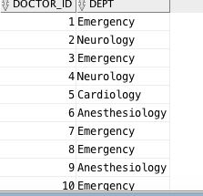
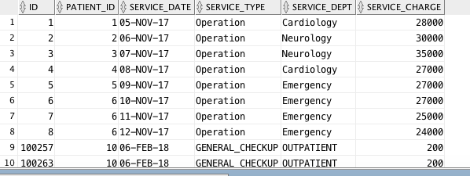
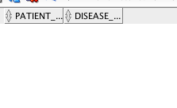
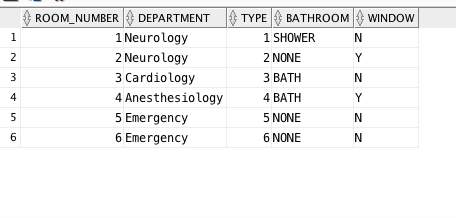

```{r setup, include=FALSE}
knitr::opts_chunk$set(echo = TRUE, tidy = TRUE)
# `r paste(readLines('project.sql'), collapse = '\n')`
#highlight: pygments
#tango
```
### Views - 

&nbsp;

```sql

 -- STAFF INFO VIEW 
CREATE OR REPLACE 
    VIEW STAFF_INFO AS
        SELECT F_NAME || ' ' || L_NAME AS NAME, ADDR_TOWN AS CITY, PHONE AS PHONE_NUMBER, ID, ADDR_ZIP_CODE AS ZIP_CODE, 
                SSN, POSITION_NAME, YEARLY_SALARY AS SALARY, ADDR_STATE AS STATE, BIRTH_DATE, 
                TRUNC(MONTHS_BETWEEN(SYSDATE,BIRTH_DATE)/12) AS AGE, MARTIAL_STATUS AS MARITAL_STATUS, LAST_DEGREE, LAST_DEGREE_DATE
        FROM STAFF;
```

&nbsp;


```sql
-- DOCTOR_INFO VIEW
/** 
* THE INNER-JOINS ARENT NECESSARY FOR THE DATA GIVEN HERE BUT IF A DOCTOR HAS TWO DEGREES OR MULTIPLE CERTIFICATES IT HELPS
IN SELECTING THE LATEST DEGREE OR CERTIFICATE
* THE VIEW MIGHT HAVE MULTIPLE LISTINGS FOR THE SAME DOCTOR IF THEY HAVE MULTIPLE SPECIALTIES
*/

CREATE OR REPLACE 
    VIEW DOCTOR_INFO AS
        SELECT D.F_NAME || ' ' || D.L_NAME AS NAME, 
                D.ADDR_NUMBER||' '||D.ADDR_STREET||' '||D.ADDR_TOWN||' '||D.ADDR_STATE AS ADDRESS, 
                D.PHONE_HOME AS HOME_PHONE_NUMBER, D.ID, D.ADDR_ZIP_CODE AS ZIP_CODE, D.SSN, D.YEARLY_SALARY AS SALARY, 
                D.ADDR_STATE AS STATE, D.BIRTH_DATE, TRUNC(MONTHS_BETWEEN(SYSDATE,D.BIRTH_DATE)/12) AS AGE, 
                D.MARTIAL_STATUS AS MARITAL_STATUS, D.PHONE_CELL AS CELL_PHONE , D.LICENSE, DOC.DEGREE_NAME AS LAST_DEGREE,
                DOC.DEGREE_DATE AS LAST_DEGREE_DATE, CERT.CERT_NAME AS LAST_CERTIFICATE, CERT.CERT_EXP_DATE AS LAST_CERTIFICATE_DATE,
                SP.SPECIALTY
        FROM DOCTOR D, (SELECT L.DOCTOR_ID , L.DEGREE_NAME, L.DEGREE_DATE 
                        FROM DOCTOR_DEGREES L
                            INNER JOIN(
                                SELECT MAX(DEGREE_DATE) AS LAST_DEGREE, DOCTOR_ID AS ID
                                FROM DOCTOR_DEGREES
                                GROUP BY DOCTOR_ID) M
                            ON L.DOCTOR_ID = M.ID AND L.DEGREE_DATE = M.LAST_DEGREE) DOC,
                        (SELECT L.DOCTOR_ID, L.CERT_NAME, L.CERT_EXP_DATE
                         FROM DOCTOR_CERT L
                            INNER JOIN(
                                SELECT MAX(CERT_EXP_DATE) AS LAST_CERT, DOCTOR_ID AS ID
                                FROM DOCTOR_CERT
                                GROUP BY DOCTOR_ID) M
                            ON L.DOCTOR_ID = M.ID AND L.CERT_EXP_DATE=M.LAST_CERT) CERT, DOCTOR_SPECIALTIES SP
        WHERE D.ID = DOC.DOCTOR_ID AND D.ID = CERT.DOCTOR_ID AND D.ID = SP.DOCTOR_ID;
```

&nbsp;

```sql

-- DOCTOR_DEGREE_INFO VIEW
CREATE OR REPLACE 
    VIEW DOCTOR_DEGREE_INFO AS 
        SELECT D.F_NAME || ' ' || D.L_NAME AS NAME, D.ID AS ID, D.LICENSE AS LICENSE_NO, DEG.DEGREE_NAME AS DEGREE_LIST, 
                DEG.DEGREE_DATE, CERT.CERT_NAME AS CERTIFICATE, CERT.CERT_EXP_DATE AS CERTIFICATE_DATE, SP.SPECIALTY
        FROM DOCTOR D, 
        (SELECT DOCTOR_ID, LISTAGG(DEGREE_NAME, ',') WITHIN GROUP (ORDER BY DEGREE_NAME) AS DEGREE_NAME,
         LISTAGG(DEGREE_DATE, ',') WITHIN GROUP (ORDER BY DEGREE_DATE) AS DEGREE_DATE
         FROM DOCTOR_DEGREES
         GROUP BY DOCTOR_ID) DEG, 
        (SELECT DOCTOR_ID, LISTAGG(CERT_NAME, ',') WITHIN GROUP (ORDER BY CERT_NAME) AS CERT_NAME,
                LISTAGG(CERT_EXP_DATE, ',') WITHIN GROUP (ORDER BY CERT_EXP_DATE) AS CERT_EXP_DATE
         FROM DOCTOR_CERT
         GROUP BY DOCTOR_ID) CERT,
        (SELECT DOCTOR_ID, LISTAGG(SPECIALTY, ',') WITHIN GROUP (ORDER BY SPECIALTY) AS SPECIALTY
         FROM DOCTOR_SPECIALTIES
         GROUP BY DOCTOR_ID) SP
        WHERE D.ID = DEG.DOCTOR_ID AND D.ID = CERT.DOCTOR_ID AND D.ID = SP.DOCTOR_ID;
```

&nbsp;

```sql
-- EMPLOYEES VIEW
-- PHONE NUMBER HAS BEEN SELECTED BASED ON AVILIBILITY AND APPROPRIATENESS, DR - CELL, NURSE - HOME_PHONE AND STAFF - PHONE
CREATE OR REPLACE 
    VIEW EMPLOYEES AS       
    (SELECT F_NAME, L_NAME, ADDR_NUMBER||' '||ADDR_STREET||' '||ADDR_TOWN||' '||ADDR_STATE||' '||ADDR_ZIP_CODE AS ADDRESS,
            'DR.' AS TYPE, YEARLY_SALARY AS SALARY, MARTIAL_STATUS AS MARITAL_STATUS, ID, SSN, PHONE_CELL AS PHONE_NUMBER, 
            TRUNC(MONTHS_BETWEEN(SYSDATE,BIRTH_DATE)/12) AS AGE
     FROM DOCTOR)
    UNION ALL
    (SELECT F_NAME, L_NAME, ADDR_NUMBER||' '||ADDR_STREET||' '||ADDR_TOWN||' '||ADDR_STATE||' '||ADDR_ZIP_CODE AS ADDRESS,
            'STAFF' AS TYPE, YEARLY_SALARY AS SALARY, MARTIAL_STATUS AS MARITAL_STATUS, ID, SSN, PHONE AS PHONE_NUMBER, 
            TRUNC(MONTHS_BETWEEN(SYSDATE,BIRTH_DATE)/12) AS AGE
     FROM STAFF)
    UNION ALL
    (SELECT F_NAME, L_NAME, ADDR_NUMBER||' '||ADDR_STREET||' '||ADDR_TOWN||' '||ADDR_STATE||' '||ADDR_ZIP_CODE AS ADDRESS,
            'NURSE' AS TYPE, YEARLY_SALARY AS SALARY, MARTIAL_STATUS AS MARITAL_STATUS, ID, SSN, PHONE_HOME AS PHONE_NUMBER, 
            TRUNC(MONTHS_BETWEEN(SYSDATE,BIRTH_DATE)/12) AS AGE
     FROM NURSE);
```

&nbsp;


```sql
-- PATIENT_INFO
-- PATIENT_ACCOUNT_PAYMENT HAS NO DATA HENCE THIS VIEW IS EMPTY
CREATE OR REPLACE 
    VIEW PATIENT_INFO AS 
        SELECT P.ID, P.F_NAME || ' ' || P.L_NAME AS NAME, 
        P.ADDR_NUMBER||' '||P.ADDR_STREET||' '||P.ADDR_TOWN||' '||P.ADDR_STATE||' '||P.ADDR_ZIP_CODE AS ADDRESS,
        P.PHONE AS PHONE_NUMBER, P.BIRTH_DATE, P.DRIVERS_LICENSE_NUMBER||' '||P.DRIVERS_LICENSE_STATE DRIVERS_LICENSE_INFO,
        CHARGES.TOTAL_CHARGE, PAYMENTS.TOTAL_PAYMENT, CHARGES.SERVICE_COUNT  
        FROM PATIENT P, (SELECT PATIENT_ID, SUM(SERVICE_CHARGE) AS TOTAL_CHARGE, COUNT(*) AS SERVICE_COUNT
                         FROM PATIENT_ACCOUNT_SERVICES
                         GROUP BY PATIENT_ID) CHARGES,
                        (SELECT  PATIENT_ID, SUM(PAYMENT) AS TOTAL_PAYMENT 
                         FROM PATIENT_ACCOUNT_PAYMENT
                         GROUP BY PATIENT_ID) PAYMENTS
        WHERE P.ID = CHARGES.PATIENT_ID OR P.ID = CHARGES.PATIENT_ID;

```

```sql
-- HIGH_USER_CUSTOMERS
-- PATIENTS WHO USED THE SERVICES MORE THAN 4 TIMES IN THE LAST YEAR

CREATE OR REPLACE
    VIEW HIGH_USER_CUSTOMERS AS  
        SELECT P.F_NAME || ' ' || P.L_NAME AS NAME, TRUNC(MONTHS_BETWEEN(SYSDATE,P.BIRTH_DATE)/12) AS AGE, P.SSN, P.ID,
               P.ADDR_NUMBER||' '||P.ADDR_STREET||' '||P.ADDR_TOWN||' '||P.ADDR_STATE AS ADDRESS, P.ADDR_ZIP_CODE AS ZIP_CODE,
               P_ACCOUNT.SERVICE_COUNT
        FROM PATIENT P, (SELECT PATIENT_ID, COUNT(*) AS SERVICE_COUNT 
                            FROM PATIENT_ACCOUNT_SERVICES
                            GROUP BY PATIENT_ID
                            HAVING COUNT(*) > 1) P_ACCOUNT
        WHERE P.ID = P_ACCOUNT.PATIENT_ID;
``` 

&nbsp;

```sql
-- DEPT_SERVICES

CREATE OR REPLACE
    VIEW DEPT_SERVICES AS    
        SELECT DEPT_WITH_HEAD.DEPARTMENT, DEPT_WITH_HEAD.HEAD_OF_DEPARTMENT, SERVICE_COUNT.YEAR, 
               SERVICE_COUNT.CNT AS NUMBER_OF_PATIENTS_SERVED
        FROM    (SELECT SERVICE_DEPT, EXTRACT(YEAR FROM SERVICE_DATE) AS YEAR ,COUNT(*) AS CNT
                 FROM PATIENT_ACCOUNT_SERVICES
                 GROUP BY SERVICE_DEPT,EXTRACT(YEAR FROM SERVICE_DATE)) SERVICE_COUNT,
                (SELECT DEP_INFO.NAME AS DEPARTMENT, DOC_INFO.DOC_NAME AS HEAD_OF_DEPARTMENT
                 FROM (SELECT NAME, HEAD FROM DEPARTMENT) DEP_INFO,
                      (SELECT F_NAME || ' ' || L_NAME AS DOC_NAME, ID FROM DOCTOR) DOC_INFO
                 WHERE DEP_INFO.HEAD = DOC_INFO.ID) DEPT_WITH_HEAD
        WHERE SERVICE_COUNT.SERVICE_DEPT = DEPT_WITH_HEAD.DEPARTMENT;
```

&nbsp;

```sql 
 -- OPERATING_ROOM_USAGE
 
CREATE OR REPLACE
    VIEW OPERATING_ROOM_USAGE AS            
        SELECT EXTRACT(YEAR FROM SURGERY_TIME) AS YEAR, EXTRACT(MONTH FROM SURGERY_TIME) AS MONTH, 
               COUNT(*) AS TOTAL_NO_OPERATIONS
        FROM REQUEST_OPERATING_ROOM
        GROUP BY EXTRACT(YEAR FROM SURGERY_TIME), EXTRACT(MONTH FROM SURGERY_TIME);
``` 

&nbsp;

```sql
-- STATISTICS_BY_DEPARTMENT

-- EACH VISIT TO A PATIENT - NO OF VISITS
-- UNIQUE PATIENT COUNT - NO OF HOSPITALIZED PATIENTS

CREATE OR REPLACE
    VIEW STATISTICS_BY_DEPARTMENT AS
        SELECT A.DEPARTMENT, A.DOCTOR_NAME, B.YEAR, B.TOTAL_VISITS, B.NO_OF_HOSPITALIZED_PATIENTS
        FROM
            (SELECT DOC_W.DEPT AS DEPARTMENT, D.F_NAME||' '||D.L_NAME AS DOCTOR_NAME, D.ID, DOC_V.PATIENT_ID
                FROM DOC_WORKS_AT DOC_W,  (SELECT UNIQUE(DOCTOR_ID), PATIENT_ID FROM DOC_VISIT) DOC_V,  DOCTOR D
                WHERE DOC_V.DOCTOR_ID = DOC_W.DOCTOR_ID AND D.ID = DOC_V.DOCTOR_ID AND D.ID = DOC_W.DOCTOR_ID) A,
            (SELECT DOCTOR_ID, EXTRACT(YEAR FROM VISIT_TIME) AS YEAR, COUNT(PATIENT_ID) AS TOTAL_VISITS ,
                COUNT(UNIQUE(PATIENT_ID)) AS NO_OF_HOSPITALIZED_PATIENTS
                FROM DOC_VISIT
                GROUP BY DOCTOR_ID, EXTRACT(YEAR FROM VISIT_TIME)) B
        WHERE A.ID = B.DOCTOR_ID;

```

&nbsp;

```sql
-- MENTORS

CREATE OR REPLACE 
    VIEW MENTORS AS
        SELECT A.DOCTOR_NAME, A.DOCTOR_SPECIALTY, B.MENTOR_NAME, B.MENTOR_SPECIALTY   
        FROM   (SELECT D.NAME AS DOCTOR_NAME, D.SPECIALTY AS DOCTOR_SPECIALTY, D.ID
                FROM DOCTOR_DEGREE_INFO D, MENTOR_DOCTOR M
                WHERE D.ID = M.OTHER_DOCTOR) A,
               (SELECT D.NAME AS MENTOR_NAME, D.SPECIALTY AS MENTOR_SPECIALTY, M.OTHER_DOCTOR
                FROM DOCTOR_DEGREE_INFO D, MENTOR_DOCTOR M
                WHERE D.ID = M.MENTOR) B
        WHERE A.ID = B.OTHER_DOCTOR;
```

&nbsp;

```sql
-- BED_USED

CREATE OR REPLACE 
    VIEW BED_USED AS
        SELECT B_USE.BED_ID AS BED_NUMBER, B_USE.ROOM_NUMBER, P.F_NAME||' '||P.L_NAME AS PATIENT_NAME, 
                D.F_NAME||' '||D.L_NAME AS DOCTOR_NAME, D_WRK.DEPT AS DEPARTMENT
        FROM PATIENT P, DOCTOR D, DOC_WORKS_AT D_WRK,
            (SELECT RH.DOCTOR_ID, RH.PATIENT_ID,B.ID AS BED_ID, B.ROOM_NUMBER
             FROM REQUEST_HOSPITALIZATION RH, BED B
             WHERE B.PATIENT= RH.PATIENT_ID) B_USE
        WHERE B_USE.PATIENT_ID = P.ID AND B_USE.DOCTOR_ID = D.ID AND B_USE.DOCTOR_ID = D_WRK.DOCTOR_ID;

```

&nbsp;

```sql
-- SMOKERS

CREATE OR REPLACE 
    VIEW SMOKERS AS
        SELECT P.ID, P.F_NAME || ' ' || P.L_NAME AS NAME, 
               P.ADDR_NUMBER||' '||P.ADDR_STREET||' '||P.ADDR_TOWN||' '||P.ADDR_STATE||' '||P.ADDR_ZIP_CODE AS ADDRESS,
               P.PHONE AS PHONE_NUMBER, P.BIRTH_DATE, P.ADDR_STATE AS STATE, HIST.TYPE AS ALLERGY_TYPE, 
               HIST.REACTION AS REACTION_TO_ALLERGY, HIST.SEVERITY
        FROM PATIENT P, PATIENT_ALLERGY_HISTORY HIST
        WHERE  P.SMOKER = 'Y' OR P.ID = HIST.PATIENT_ID;
 
        
-- TWO MORE CUSTOM VIEWS FOR PATIENTS

-- CUSTOM_VIEW1
-- GIVES DETAILS REGARDING THE VARIOUS TYPES OF ROOMS AVAILABLE AT THE HOSPITAL
CREATE OR REPLACE
    VIEW ROOM_INFO AS   
        SELECT * 
        FROM PATIENT_ROOM;


-- CUSTOM_VIEW2
-- GIVES THE DETAILS OF VARIOUS DEPARTMENTS FOR PATIENTS IN CASE THEY NEED TO CONTACT DEPARTMENT HEADS FOR GRIEVENCE REDDRESSAL
CREATE OR REPLACE
    VIEW DEPARTMENT_INFO AS
        SELECT NAME AS DEPARTMENT_NAME, LOCATION, HEAD AS HEAD_OF_DEPARTMENT, PHONE, URL
        FROM DEPARTMENT;
```


&nbsp;

&nbsp;

&nbsp;


### Sequences - 

&nbsp;

```sql
-- SEQUENCES

-- ID_GENERATOR

CREATE SEQUENCE ID_GENERATOR
INCREMENT BY 2
START WITH 100003
CACHE 40;

-- OERATING_ROOM_SEQUENCE
-- THERE ARE SIX DIFFERENT ROOMS HENCE CACHE SIZE OF 6
-- THE SEQUENCE STARTS AT 1
CREATE SEQUENCE OERATING_ROOM_SEQUENCE
INCREMENT BY 1
START WITH 1
CACHE 6;

-- orderTrackNumber

CREATE SEQUENCE orderTrackNumber
INCREMENT BY 1
START WITH 0
MINVALUE 0;

```
&nbsp;

### Subprograms & Packages -

&nbsp;

#### Patient package - 

&nbsp;

```sql
-- PATIENT_PKG

-- PACKAGE DECLARATIONS
CREATE OR REPLACE PACKAGE PATIENT_PKG AS
    TYPE PATIENT_RECORD IS RECORD(
        NAME VARCHAR2(255),
        SSN NUMBER(9,0),
        DR_LICENSE NUMBER,
        ADDRESS VARCHAR2(255),
        PHONE NUMBER(10,0),
        LAST_SERVICE_DATE DATE,
        SERVICE_TYPE VARCHAR2(32 BYTE),
        BALANCE NUMBER,
        INSURANCE_NAME VARCHAR2(32 BYTE),
        INSURANCE_NUMBER NUMBER   
    );
    
    TMP_OUTPUT_VAR PATIENT_RECORD;
    
    TYPE TMP_REC1 IS RECORD
    (TMP_FIELD PATIENT%ROWTYPE);
    
    TYPE TMP_REC2 IS RECORD
    (TMP_FIELD PATIENT_ACCOUNT_SERVICES%ROWTYPE);
    
    FUNCTION PATIENT_INFO(P_ID NUMBER) RETURN PATIENT_RECORD;
    
    -- OVERLOADED PATINET_INFO - TAKES SSN INPUT
    FUNCTION PATIENT_INFO(P_SSN VARCHAR) RETURN PATIENT_RECORD;
    
    -- OVERLOADED PATINET_INFO - TAKES PATIENT NAME AS INPUT
    FUNCTION PATIENT_INFO(P_F_NAME VARCHAR2, P_L_NAME VARCHAR2) RETURN PATIENT_RECORD;
    
    -- HOSPITALIZED_PATIENT
    TYPE HOSPITAL_RECORD IS RECORD(
        PATIENT_NAME VARCHAR2(255),
        OPERATION_DATE DATE,
        OPERATION_TYPE VARCHAR2(45),
        ROOM_NO VARCHAR2(15),
        STAY_LENGTH NUMBER,
        DOCTOR_NAME VARCHAR2(255),
        DEPT VARCHAR2(45),
        COST_OF_STAY NUMBER
    );

    
    FUNCTION HOSPITALIZED_PATIENT(P_ID NUMBER) RETURN SYS_REFCURSOR;
    
    -- PATIENT_STATUS
    FUNCTION PATIENT_STATUS(P_F_NAME VARCHAR2,P_L_NAME VARCHAR2) RETURN VARCHAR2;
    
    -- PATIENT_RELEASE
    FUNCTION PATIENT_RELEASE(P_SSN VARCHAR2) RETURN DATE;
    
    -- OVERLOADED PATIENT_RELEASE, ACCEPTS PATIENT ID AS INPUT
    FUNCTION PATIENT_RELEASE(P_ID NUMBER) RETURN DATE;
    
    --OVERLOADED PATIENT_RELEASE, ACCEPTS PATIENT NAME AS INPUT
    FUNCTION PATIENT_RELEASE(P_F_NAME VARCHAR2,P_L_NAME VARCHAR2) RETURN DATE;
    
    -- PATIENT_MEDICAL_HISTORY - RETURN INFECTION HISTORY OF THE PATIENT
    FUNCTION PATIENT_MEDICAL_HISTORY(P_SSN NUMBER) RETURN VARCHAR2;
    
    -- ALLERGY_LIST  - RETURN ALLERGY PATIENTS FOR A GIVEN ALLERGY
    FUNCTION ALLERGY_LIST(ALLERGY_NAME VARCHAR2) RETURN VARCHAR2;
    
END PATIENT_PKG;
/
```

&nbsp;

```sql
-- PACKAGE BODY
CREATE OR REPLACE PACKAGE BODY PATIENT_PKG AS
    FUNCTION PATIENT_INFO(P_ID NUMBER) RETURN PATIENT_RECORD IS
        TMP_PATIENT PATIENT_RECORD;
        TMP_VAR1 TMP_REC1;
        TMP_VAR2 TMP_REC2;
        TMP_VAR_TOTAL_PAY NUMBER;
        TMP_VAR_TOTAL_CHARGE NUMBER;
        TMP_VAR_INSURANCE_NUMBER NUMBER;
        TMP_VAR_INSURANCE_NAME VARCHAR2(45);
        
    BEGIN
        SELECT *
        INTO TMP_VAR1.TMP_FIELD
        FROM PATIENT
        WHERE ID = P_ID;
        
        SELECT P.ID,P.PATIENT_ID, P.SERVICE_DATE, P.SERVICE_TYPE, P.SERVICE_DEPT, P.SERVICE_CHARGE
        INTO TMP_VAR2.TMP_FIELD
        FROM PATIENT_ACCOUNT_SERVICES P, 
            (SELECT MAX(SERVICE_DATE) AS MAX_DATE FROM PATIENT_ACCOUNT_SERVICES WHERE PATIENT_ID = P_ID )D
        WHERE P.PATIENT_ID = P_ID AND P.SERVICE_DATE=D.MAX_DATE;
        
        SELECT SUM(SERVICE_CHARGE) AS TOTAL_CHARGE
        INTO TMP_VAR_TOTAL_CHARGE
        FROM PATIENT_ACCOUNT_SERVICES
        WHERE PATIENT_ID = P_ID;
        
        SELECT SUM(PAYMENT) AS TOTAL_PAY
        INTO TMP_VAR_TOTAL_PAY
        FROM PATIENT_ACCOUNT_PAYMENT 
        WHERE PATIENT_ID = P_ID;
        
        SELECT I.INSURANCE_NUMBER, I.CO_NAME
        INTO TMP_VAR_INSURANCE_NUMBER, TMP_VAR_INSURANCE_NAME
        FROM (SELECT * FROM INSURANCE) I,
             (SELECT * FROM PATIENT WHERE ID = P_ID)P
        WHERE I.INSURANCE_NUMBER = P.PRIMARY_INSUR_NUMBER;
        
         TMP_PATIENT.NAME := TMP_VAR1.TMP_FIELD.F_NAME||' '||TMP_VAR1.TMP_FIELD.L_NAME;
         TMP_PATIENT.SSN := TMP_VAR1.TMP_FIELD.SSN;
         TMP_PATIENT.DR_LICENSE := TMP_VAR1.TMP_FIELD.DRIVERS_LICENSE_NUMBER;
         TMP_PATIENT.ADDRESS := TMP_VAR1.TMP_FIELD.ADDR_NUMBER||' '||TMP_VAR1.TMP_FIELD.ADDR_STREET||' '||TMP_VAR1.TMP_FIELD.ADDR_TOWN||' '||
                                TMP_VAR1.TMP_FIELD.ADDR_STATE||' '||TMP_VAR1.TMP_FIELD.ADDR_ZIP_CODE;
         TMP_PATIENT.PHONE := TMP_VAR1.TMP_FIELD.PHONE;
         TMP_PATIENT.LAST_SERVICE_DATE:= TMP_VAR2.TMP_FIELD.SERVICE_DATE;
         TMP_PATIENT.SERVICE_TYPE:= TMP_VAR2.TMP_FIELD.SERVICE_TYPE;
         TMP_PATIENT.BALANCE:= TMP_VAR_TOTAL_CHARGE-TMP_VAR_TOTAL_PAY;
         TMP_PATIENT.INSURANCE_NAME := TMP_VAR_INSURANCE_NAME;
         TMP_PATIENT.INSURANCE_NUMBER := TMP_VAR_INSURANCE_NUMBER;

        RETURN TMP_PATIENT;
        
        TMP_PATIENT.NAME:='';
        TMP_PATIENT.SSN :='';
        TMP_PATIENT.DR_LICENSE := '';
        TMP_PATIENT.ADDRESS :='';
        TMP_PATIENT.PHONE :='';
        TMP_PATIENT.LAST_SERVICE_DATE:= '';
        TMP_PATIENT.SERVICE_TYPE:='';
        TMP_PATIENT.BALANCE:='';
        TMP_PATIENT.INSURANCE_NAME := '';
        TMP_PATIENT.INSURANCE_NUMBER :=''; 
        EXCEPTION
            WHEN NO_DATA_FOUND THEN
            DBMS_OUTPUT.put_line('PLEASE CHECK THE PATIENT ID. IT DOES NOT EXIST IN THE DATABSE '||SQLCODE);
            RETURN TMP_PATIENT;
            WHEN OTHERS THEN
            DBMS_OUTPUT.put_line('THERE IS AN ISSUE WITH THE DATABASE, PLEASE CHECK BACK LATER '|| SQLCODE);
            RETURN TMP_PATIENT; 
    END;
                
    -- OVERLOADED FUNCTION
    -- TAKES SSN AND THEN GETS THE PATIENT ID FROM THAT 
    -- SAVES IT INTO A TEMP VARIABLE AND USES THAT VARIABLE FOR THE REST OF THE FUNCTIONS
    FUNCTION PATIENT_INFO(P_SSN VARCHAR) RETURN PATIENT_RECORD IS
        TMP_PATIENT PATIENT_RECORD;
        TMP_VAR1 TMP_REC1;
        TMP_VAR2 TMP_REC2;
        TMP_ID NUMBER;
        TMP_VAR_TOTAL_PAY NUMBER;
        TMP_VAR_TOTAL_CHARGE NUMBER;
        TMP_VAR_INSURANCE_NUMBER NUMBER;
        TMP_VAR_INSURANCE_NAME VARCHAR2(45);
    BEGIN
    
        SELECT *
        INTO TMP_VAR1.TMP_FIELD
        FROM PATIENT
        WHERE SSN = TO_NUMBER(P_SSN);
        
        TMP_ID := TMP_VAR1.TMP_FIELD.ID;
        
        SELECT P.ID,P.PATIENT_ID, P.SERVICE_DATE, P.SERVICE_TYPE, P.SERVICE_DEPT, P.SERVICE_CHARGE
        INTO TMP_VAR2.TMP_FIELD
        FROM PATIENT_ACCOUNT_SERVICES P, 
            (SELECT MAX(SERVICE_DATE) AS MAX_DATE FROM PATIENT_ACCOUNT_SERVICES WHERE PATIENT_ID = TMP_ID )D
        WHERE P.PATIENT_ID = TMP_ID AND P.SERVICE_DATE=D.MAX_DATE;
        
        SELECT SUM(SERVICE_CHARGE) AS TOTAL_CHARGE
        INTO TMP_VAR_TOTAL_CHARGE
        FROM PATIENT_ACCOUNT_SERVICES
        WHERE PATIENT_ID = TMP_ID;
        
        SELECT SUM(PAYMENT) AS TOTAL_PAY
        INTO TMP_VAR_TOTAL_PAY
        FROM PATIENT_ACCOUNT_PAYMENT 
        WHERE PATIENT_ID = TMP_ID;
        
        SELECT I.INSURANCE_NUMBER, I.CO_NAME
        INTO TMP_VAR_INSURANCE_NUMBER, TMP_VAR_INSURANCE_NAME
        FROM (SELECT * FROM INSURANCE) I,
             (SELECT * FROM PATIENT WHERE ID = TMP_ID)P
        WHERE I.INSURANCE_NUMBER = P.PRIMARY_INSUR_NUMBER;
        
         TMP_PATIENT.NAME := TMP_VAR1.TMP_FIELD.F_NAME||' '||TMP_VAR1.TMP_FIELD.L_NAME;
         TMP_PATIENT.SSN := TMP_VAR1.TMP_FIELD.SSN;
         TMP_PATIENT.DR_LICENSE := TMP_VAR1.TMP_FIELD.DRIVERS_LICENSE_NUMBER;
         TMP_PATIENT.ADDRESS := TMP_VAR1.TMP_FIELD.ADDR_NUMBER||' '||TMP_VAR1.TMP_FIELD.ADDR_STREET||' '||TMP_VAR1.TMP_FIELD.ADDR_TOWN||' '||
                                TMP_VAR1.TMP_FIELD.ADDR_STATE||' '||TMP_VAR1.TMP_FIELD.ADDR_ZIP_CODE;
         TMP_PATIENT.PHONE := TMP_VAR1.TMP_FIELD.PHONE;
         TMP_PATIENT.LAST_SERVICE_DATE:= TMP_VAR2.TMP_FIELD.SERVICE_DATE;
         TMP_PATIENT.SERVICE_TYPE:= TMP_VAR2.TMP_FIELD.SERVICE_TYPE;
         TMP_PATIENT.BALANCE:= TMP_VAR_TOTAL_CHARGE-TMP_VAR_TOTAL_PAY;
         TMP_PATIENT.INSURANCE_NAME := TMP_VAR_INSURANCE_NAME;
         TMP_PATIENT.INSURANCE_NUMBER := TMP_VAR_INSURANCE_NUMBER;

        RETURN TMP_PATIENT;
        
        TMP_PATIENT.NAME:='';
        TMP_PATIENT.SSN :='';
        TMP_PATIENT.DR_LICENSE := '';
        TMP_PATIENT.ADDRESS :='';
        TMP_PATIENT.PHONE :='';
        TMP_PATIENT.LAST_SERVICE_DATE:= '';
        TMP_PATIENT.SERVICE_TYPE:='';
        TMP_PATIENT.BALANCE:='';
        TMP_PATIENT.INSURANCE_NAME := '';
        TMP_PATIENT.INSURANCE_NUMBER :=''; 
        
        EXCEPTION
            WHEN NO_DATA_FOUND THEN
            DBMS_OUTPUT.put_line('PLEASE CHECK THE PATIENT SSN. IT DOES NOT EXIST IN THE DATABSE '||SQLCODE);
            RETURN TMP_PATIENT;
            WHEN OTHERS THEN
            DBMS_OUTPUT.put_line('THERE IS AN ISSUE WITH THE DATABASE, PLEASE CHECK BACK LATER '|| SQLCODE);
            RETURN TMP_PATIENT; 
    END;
    
    --SECOND OVERLOADED FUNCTION
    -- TAKES FIRST AND LAST NAME OF THE PATIENT AS INPUT
    -- ASSUMES NAMES ARE UNIQUE IN THE DATABASE
    FUNCTION PATIENT_INFO(P_F_NAME VARCHAR2, P_L_NAME VARCHAR2) RETURN PATIENT_RECORD IS
        TMP_PATIENT PATIENT_RECORD;
        TMP_VAR1 TMP_REC1;
        TMP_VAR2 TMP_REC2;
        TMP_ID NUMBER;
        TMP_VAR_TOTAL_PAY NUMBER;
        TMP_VAR_TOTAL_CHARGE NUMBER;
        TMP_VAR_INSURANCE_NUMBER NUMBER;
        TMP_VAR_INSURANCE_NAME VARCHAR2(45);
    BEGIN
        -- SELECT THE ID OF THE PATIENT BASED ON NAME 
        -- THEN USE THAT FOR THE REST OF THE QUIERIES
        
        SELECT *
        INTO TMP_VAR1.TMP_FIELD
        FROM PATIENT
        WHERE F_NAME = P_F_NAME AND L_NAME = P_L_NAME;
        
        TMP_ID := TMP_VAR1.TMP_FIELD.ID;
        
        SELECT P.ID,P.PATIENT_ID, P.SERVICE_DATE, P.SERVICE_TYPE, P.SERVICE_DEPT, P.SERVICE_CHARGE
        INTO TMP_VAR2.TMP_FIELD
        FROM PATIENT_ACCOUNT_SERVICES P, 
            (SELECT MAX(SERVICE_DATE) AS MAX_DATE FROM PATIENT_ACCOUNT_SERVICES WHERE PATIENT_ID = TMP_ID )D
        WHERE P.PATIENT_ID = TMP_ID AND P.SERVICE_DATE=D.MAX_DATE;
        
        SELECT SUM(SERVICE_CHARGE) AS TOTAL_CHARGE
        INTO TMP_VAR_TOTAL_CHARGE
        FROM PATIENT_ACCOUNT_SERVICES
        WHERE PATIENT_ID = TMP_ID;
        
        SELECT SUM(PAYMENT) AS TOTAL_PAY
        INTO TMP_VAR_TOTAL_PAY
        FROM PATIENT_ACCOUNT_PAYMENT 
        WHERE PATIENT_ID = TMP_ID;
        
        SELECT I.INSURANCE_NUMBER, I.CO_NAME
        INTO TMP_VAR_INSURANCE_NUMBER, TMP_VAR_INSURANCE_NAME
        FROM (SELECT * FROM INSURANCE) I,
             (SELECT * FROM PATIENT WHERE ID = TMP_ID)P
        WHERE I.INSURANCE_NUMBER = P.PRIMARY_INSUR_NUMBER;
        
         TMP_PATIENT.NAME := TMP_VAR1.TMP_FIELD.F_NAME||' '||TMP_VAR1.TMP_FIELD.L_NAME;
         TMP_PATIENT.SSN := TMP_VAR1.TMP_FIELD.SSN;
         TMP_PATIENT.DR_LICENSE := TMP_VAR1.TMP_FIELD.DRIVERS_LICENSE_NUMBER;
         TMP_PATIENT.ADDRESS := TMP_VAR1.TMP_FIELD.ADDR_NUMBER||' '||TMP_VAR1.TMP_FIELD.ADDR_STREET||' '||TMP_VAR1.TMP_FIELD.ADDR_TOWN||' '||
                                TMP_VAR1.TMP_FIELD.ADDR_STATE||' '||TMP_VAR1.TMP_FIELD.ADDR_ZIP_CODE;
         TMP_PATIENT.PHONE := TMP_VAR1.TMP_FIELD.PHONE;
         TMP_PATIENT.LAST_SERVICE_DATE:= TMP_VAR2.TMP_FIELD.SERVICE_DATE;
         TMP_PATIENT.SERVICE_TYPE:= TMP_VAR2.TMP_FIELD.SERVICE_TYPE;
         TMP_PATIENT.BALANCE:= TMP_VAR_TOTAL_CHARGE-TMP_VAR_TOTAL_PAY;
         TMP_PATIENT.INSURANCE_NAME := TMP_VAR_INSURANCE_NAME;
         TMP_PATIENT.INSURANCE_NUMBER := TMP_VAR_INSURANCE_NUMBER;


        RETURN TMP_PATIENT;
        
        TMP_PATIENT.NAME:='';
        TMP_PATIENT.SSN :='';
        TMP_PATIENT.DR_LICENSE := '';
        TMP_PATIENT.ADDRESS :='';
        TMP_PATIENT.PHONE :='';
        TMP_PATIENT.LAST_SERVICE_DATE:= '';
        TMP_PATIENT.SERVICE_TYPE:='';
        TMP_PATIENT.BALANCE:='';
        TMP_PATIENT.INSURANCE_NAME := '';
        TMP_PATIENT.INSURANCE_NUMBER :=''; 
        
        EXCEPTION
            WHEN NO_DATA_FOUND THEN
            DBMS_OUTPUT.put_line('PLEASE CHECK THE PATIENT ID. IT DOES NOT EXIST IN THE DATABSE '||SQLCODE);
            RETURN TMP_PATIENT;
            WHEN OTHERS THEN
            DBMS_OUTPUT.put_line('THERE IS AN ISSUE WITH THE DATABASE, PLEASE CHECK BACK LATER '|| SQLCODE);
            RETURN TMP_PATIENT; 
    END;
    
    -- HOSPITALIZED_PATIENT
    
    FUNCTION HOSPITALIZED_PATIENT(P_ID NUMBER) RETURN SYS_REFCURSOR IS
        TMP_CURSOR SYS_REFCURSOR;
    BEGIN
        OPEN TMP_CURSOR FOR
            SELECT P.NAME AS PATIENT_NAME, O_R.SURGERY_TIME AS OPERATION_DATE, O_R.SURGERY_TYPE AS OPERATION_TYPE, 
                    B.ROOM_NUMBER AS ROOM, P_H.STAY_LENGTH ,DOC.NAME AS DOCTOR_NAME, P_DEP.DEPARTMENT AS DEPT, 
                    B.PRICE*P_H.STAY_LENGTH AS COST_OF_STAY
            FROM
                (SELECT F_NAME||' '||L_NAME AS NAME FROM PATIENT WHERE ID = P_ID) P,
                (SELECT SURGERY_TIME, SURGERY_TYPE, DOCTOR_ID FROM REQUEST_OPERATING_ROOM WHERE PATIENT_ID = P_ID) O_R,
                (SELECT ROOM_NUMBER,PRICE FROM BED WHERE PATIENT = P_ID) B,
                (SELECT DOCTOR_ID FROM DOC_VISIT WHERE PATIENT_ID = P_ID) D,
                (SELECT DEPARTMENT, ROOM_NUMBER FROM PATIENT_ROOM ) P_DEP,
                (SELECT F_NAME||' '||L_NAME AS NAME, ID FROM DOCTOR) DOC,
                (SELECT SYSDATE-HOSPITALIZATION_DATE AS STAY_LENGTH FROM PATIENT_HOSPITAL_HISTORY WHERE PATIENT_ID = P_ID) P_H
            WHERE DOC.ID = O_R.DOCTOR_ID AND DOC.ID = D.DOCTOR_ID AND P_DEP.ROOM_NUMBER = B.ROOM_NUMBER;
            RETURN TMP_CURSOR;
            
            TMP_CURSOR:=NULL;
            EXCEPTION
            WHEN NO_DATA_FOUND THEN
            DBMS_OUTPUT.put_line('PATIENT RECORD MAY NOT EXIST OR PLEASE CHECK THE PATIENT ID'||SQLCODE);
            RETURN TMP_CURSOR;
            WHEN OTHERS THEN
            DBMS_OUTPUT.put_line('THERE IS AN ISSUE WITH THE DATABASE, PLEASE CHECK BACK LATER '|| SQLCODE);
            RETURN TMP_CURSOR;    
    END;
    

    -- PATIENT_STATUS
    FUNCTION PATIENT_STATUS(P_F_NAME VARCHAR2,P_L_NAME VARCHAR2) RETURN VARCHAR2 IS
        TMP_STATUS VARCHAR2(155);
        TMP_ID NUMBER;
        TMP_DATE VARCHAR2(10);
        TMP_DOC VARCHAR2(100);
        TMP_ROOM VARCHAR2(10);
    BEGIN
        
        SELECT ID
        INTO TMP_ID
        FROM PATIENT
        WHERE F_NAME = P_F_NAME AND L_NAME = P_L_NAME;
        
        SELECT HOSPITALIZATION_DATE
        INTO TMP_DATE
        FROM PATIENT_HOSPITAL_HISTORY
        WHERE PATIENT_ID = TMP_ID;
        
        SELECT DOCTOR.F_NAME ||' '|| DOCTOR.L_NAME AS DOCTOR_NAME
        INTO TMP_DOC
        FROM
            (SELECT DOCTOR_ID FROM REQUEST_HOSPITALIZATION WHERE PATIENT_ID = TMP_ID) D,
            DOCTOR
        WHERE DOCTOR.ID = D.DOCTOR_ID;
        
        SELECT ROOM_NUMBER
        INTO TMP_ROOM
        FROM BED
        WHERE PATIENT = TMP_ID;
        
        TMP_STATUS := TMP_DATE||' '||TMP_ROOM||' '||TMP_DOC;
        RETURN TMP_STATUS;
        TMP_STATUS:= '';
        EXCEPTION
            WHEN NO_DATA_FOUND THEN
            DBMS_OUTPUT.put_line('THE PATIENT MIGHT HAVE BEEN DISCHARGED OR THE NAME OF THE PATIENT IS INCORRECT'||SQLCODE);
            RETURN TMP_STATUS;
            WHEN OTHERS THEN
            DBMS_OUTPUT.put_line('THERE IS AN ISSUE WITH THE DATABASE, PLEASE CHECK BACK LATER '|| SQLCODE);
            RETURN TMP_STATUS; 
    END;
    
    -- PATIENT_RELEASE
    FUNCTION PATIENT_RELEASE(P_SSN VARCHAR2) RETURN DATE IS
        TMP_ID NUMBER;
        TMP_RELEASE_DATE DATE;
    BEGIN
        SELECT ID 
        INTO TMP_ID
        FROM PATIENT
        WHERE SSN = P_SSN;
        
        SELECT SERVICE_DATE
        INTO TMP_RELEASE_DATE
        FROM
            (SELECT MAX(SERVICE_DATE) AS MAX_DATE FROM PATIENT_ACCOUNT_SERVICES WHERE PATIENT_ID = TMP_ID) X, PATIENT_ACCOUNT_SERVICES P
        WHERE P.SERVICE_DATE = X.MAX_DATE AND P.PATIENT_ID = TMP_ID;
        
        RETURN TMP_RELEASE_DATE;
        TMP_RELEASE_DATE:= '';
        EXCEPTION
            WHEN NO_DATA_FOUND THEN
            DBMS_OUTPUT.put_line('THE PATIENT MIGHT HAVE NEVER BEEN TO THE HOSPITAL OR CHECK THE SSN NUMBER'||SQLCODE);
            RETURN TMP_RELEASE_DATE;
            WHEN OTHERS THEN
            DBMS_OUTPUT.put_line('THERE IS AN ISSUE WITH THE DATABASE, PLEASE CHECK BACK LATER '|| SQLCODE);
            RETURN TMP_RELEASE_DATE; 
            
    END;
    
    --OVERLOADED PATIENT_RELEASE, ACCEPTS PATIENT ID AS INPUT
    FUNCTION PATIENT_RELEASE(P_ID NUMBER) RETURN DATE IS
        TMP_RELEASE_DATE DATE;
    BEGIN
        
        SELECT SERVICE_DATE
        INTO TMP_RELEASE_DATE
        FROM
            (SELECT MAX(SERVICE_DATE) AS MAX_DATE FROM PATIENT_ACCOUNT_SERVICES WHERE PATIENT_ID = P_ID) X, PATIENT_ACCOUNT_SERVICES P
        WHERE P.SERVICE_DATE = X.MAX_DATE AND P.PATIENT_ID = P_ID;
        
        RETURN TMP_RELEASE_DATE;
        TMP_RELEASE_DATE:= '';
        EXCEPTION
            WHEN NO_DATA_FOUND THEN
            DBMS_OUTPUT.put_line('THE PATIENT MIGHT HAVE NEVER BEEN TO THE HOSPITAL OR CHECK THE ID NUMBER'||SQLCODE);
            RETURN TMP_RELEASE_DATE;
            WHEN OTHERS THEN
            DBMS_OUTPUT.put_line('THERE IS AN ISSUE WITH THE DATABASE, PLEASE CHECK BACK LATER '|| SQLCODE);
            RETURN TMP_RELEASE_DATE; 
            
    END;
    
    --OVERLOADED PATIENT_RELEASE, ACCEPTS PATIENT NAME AS INPUT
    FUNCTION PATIENT_RELEASE(P_F_NAME VARCHAR2,P_L_NAME VARCHAR2) RETURN DATE IS
        TMP_ID NUMBER;
        TMP_RELEASE_DATE DATE;
    BEGIN
        SELECT ID 
        INTO TMP_ID
        FROM PATIENT
        WHERE F_NAME = P_F_NAME AND L_NAME = P_L_NAME; 
        
        SELECT SERVICE_DATE
        INTO TMP_RELEASE_DATE
        FROM
            (SELECT MAX(SERVICE_DATE) AS MAX_DATE FROM PATIENT_ACCOUNT_SERVICES WHERE PATIENT_ID = TMP_ID) X, PATIENT_ACCOUNT_SERVICES P
        WHERE P.SERVICE_DATE = X.MAX_DATE AND P.PATIENT_ID = TMP_ID;
        
        RETURN TMP_RELEASE_DATE;
        TMP_RELEASE_DATE:= '';
        EXCEPTION
            WHEN NO_DATA_FOUND THEN
            DBMS_OUTPUT.put_line('THE PATIENT MIGHT HAVE NEVER BEEN TO THE HOSPITAL OR CHECK THE NAME OF PATIENT'||SQLCODE);
            RETURN TMP_RELEASE_DATE;
            WHEN OTHERS THEN
            DBMS_OUTPUT.put_line('THERE IS AN ISSUE WITH THE DATABASE, PLEASE CHECK BACK LATER '|| SQLCODE);
            RETURN TMP_RELEASE_DATE; 
            
    END;
    
    -- PATIENT_MEDICAL_HISTORY - RETURN INFECTION HISTORY OF THE PATIENT
    FUNCTION PATIENT_MEDICAL_HISTORY(P_SSN NUMBER) RETURN VARCHAR2 IS
        TMP_ID NUMBER;
        TMP_HISTORY VARCHAR2(500);
    BEGIN
        SELECT ID 
        INTO TMP_ID
        FROM PATIENT
        WHERE SSN = P_SSN;
        
        SELECT LISTAGG(DISEASE_TYPE, ', ') WITHIN GROUP (ORDER BY DISEASE_TYPE) OVER (PARTITION BY PATIENT_ID)
        INTO TMP_HISTORY
        FROM PATIENT_INFECTION_HISTORY
        WHERE PATIENT_ID = TMP_ID;
        
        RETURN TMP_HISTORY;
        TMP_HISTORY:= '';
        EXCEPTION
            WHEN NO_DATA_FOUND THEN
            DBMS_OUTPUT.put_line('THE PATIENT MIGHT NOT HAVE A HISTORY OR CHECK THE SSN OF PATIENT'||SQLCODE);
            RETURN TMP_HISTORY;
            WHEN OTHERS THEN
            DBMS_OUTPUT.put_line('THERE IS AN ISSUE WITH THE DATABASE, PLEASE CHECK BACK LATER '|| SQLCODE);
            RETURN TMP_HISTORY;
    END;
    
    -- ALLERGY_LIST  - RETURN ALLERGY PATIENTS FOR A GIVEN ALLERGY
    FUNCTION ALLERGY_LIST(ALLERGY_NAME VARCHAR2) RETURN VARCHAR2 IS
        TMP_P VARCHAR2(500);
    BEGIN
        
        SELECT LISTAGG(X.PATIENT_NAME, ', ') WITHIN GROUP (ORDER BY X.PATIENT_NAME)
        INTO TMP_P
        FROM
            (SELECT PATIENT_ID FROM PATIENT_ALLERGY_HISTORY WHERE TYPE = ALLERGY_NAME) P,
            (SELECT F_NAME||' '||L_NAME AS PATIENT_NAME, ID FROM PATIENT) X
        WHERE X.ID = P.PATIENT_ID;
    
        RETURN TMP_P;
        TMP_P:= '';
        EXCEPTION
            WHEN NO_DATA_FOUND THEN
            DBMS_OUTPUT.put_line('THERE ARE NO PATIENTS WITH THE GIVEN ALLERGY OR PLEASE CHECK THE NAME OF THE ALLERGY'||SQLCODE);
            RETURN TMP_P;
            WHEN OTHERS THEN
            DBMS_OUTPUT.put_line('THERE IS AN ISSUE WITH THE DATABASE, PLEASE CHECK BACK LATER '|| SQLCODE);
            RETURN TMP_P;
    END;
    
        
END PATIENT_PKG;
/
```
&nbsp;

##### Results -

&nbsp;


&nbsp;

&nbsp;
&nbsp;

#### Employee package -

&nbsp;

```sql
-- Employee_pkg
CREATE OR REPLACE PACKAGE Employee_pkg AS

    TYPE OR_RECORD IS RECORD(
        DOCTOR_NAME VARCHAR2(255),
        DEPT VARCHAR2(45),
        OPERATION_DATE DATE,
        OPERATION_DURATION NUMBER,
        PATIENT_NAME VARCHAR2(255),
        OPERATION_COST NUMBER
    );
    
    TMP_RECORD OR_RECORD;
    
    -- OPERATION
    FUNCTION OPERATION(D_ID NUMBER) RETURN SYS_REFCURSOR;
    
     TYPE MEDICAL_SUPPLY_RECORD IS RECORD(
     STAFF_NAME VARCHAR2(255),
     NAME VARCHAR2(255),
     QUANTITY NUMBER,
     BRAND_NAME VARCHAR2(255),
     SUPPLIER_ID NUMBER,
     SUPPLIER_NAME VARCHAR2(255)
     );
    
    -- MEDICAL_SUPPLIES
    FUNCTION MEDICAL_SUPPLIES(S_ID NUMBER) RETURN SYS_REFCURSOR;
    
    -- NON_MEDICAL_SUPPLIES
    FUNCTION NON_MEDICAL_SUPPLIES(S_ID NUMBER) RETURN SYS_REFCURSOR;
    
    TYPE NON_MEDICAL_SUPPLY_RECORD IS RECORD(
    STAFF_NAME VARCHAR2(255), 
    NAME VARCHAR2(255), 
    QUANTITY NUMBER, 
    BRAND_NAME VARCHAR2(255)
    );
    
    -- MEDICAL_SUPPLIES_ORDER
    FUNCTION MEDICAL_SUPPLIES_ORDER(S_NUMBER NUMBER) RETURN BOOLEAN;
    
    -- EMPLOYEE_LIST
    FUNCTION EMPLOYEE_LIST RETURN SYS_REFCURSOR;
    
    TYPE EMP_RECORD IS RECORD(
        NAME VARCHAR2(255),
        BIRTHDAY DATE,
        EMPLOYEE_TYPE VARCHAR2(45),
        SALARY NUMBER
    );
    
    -- OVERLOADED EMPLOYEE_LIST - ACCEPTS AN ID AND RETURNS ALL THE EMPLOYES MATCHING THE ID
    FUNCTION EMPLOYEE_LIST(E_ID NUMBER) RETURN SYS_REFCURSOR;
    
END Employee_pkg;
/
```
&nbsp;
```sql

-- Employee_pkg BODY
CREATE OR REPLACE PACKAGE BODY Employee_pkg AS
    FUNCTION OPERATION(D_ID NUMBER) RETURN SYS_REFCURSOR IS
        TMP_CURSOR SYS_REFCURSOR;
    BEGIN
        
        OPEN TMP_CURSOR FOR
        SELECT D.DOCTOR_NAME AS DOCTOR_NAME, DEP.DEPT AS DEPT, O_R.SURGERY_TIME AS OPERATION_DATE, O_R.SURGERY_DURATION AS OPERATION_DURATION, 
                P.PATIENT_NAME AS PATIENT_NAME, R.COST_PER_MIN*O_R.SURGERY_DURATION AS OPERATION_COST  
        FROM
            (SELECT DOCTOR_ID, PATIENT_ID, SURGERY_TIME, SURGERY_DURATION, OPERATING_ROOM_NUM FROM REQUEST_OPERATING_ROOM 
                WHERE DOCTOR_ID = D_ID AND SURGERY_TIME > SYSDATE-30) O_R,
            (SELECT ID,F_NAME||' '||L_NAME AS DOCTOR_NAME FROM DOCTOR  ) D,
            (SELECT DEPT,DOCTOR_ID FROM DOC_WORKS_AT ) DEP,
            (SELECT ID,F_NAME||' '||L_NAME AS PATIENT_NAME FROM PATIENT) P,
            (SELECT ROOM_NUMBER,COST_PER_MIN FROM OPERATING_ROOM  ) R
        WHERE P.ID = O_R.PATIENT_ID AND R.ROOM_NUMBER = O_R.OPERATING_ROOM_NUM AND D.ID = D_ID AND DEP.DOCTOR_ID = D_ID;
        
        RETURN TMP_CURSOR;
        TMP_CURSOR:=NULL;
        EXCEPTION
            WHEN NO_DATA_FOUND THEN
            DBMS_OUTPUT.put_line('PLEASE CHECK THE DOCTOR ID OR THE DOCTOR HAS NOT PERFORMED ANY OPERATIONS RECENTLY '||SQLCODE);
            RETURN TMP_CURSOR;
            WHEN OTHERS THEN
            DBMS_OUTPUT.put_line('THERE IS AN ISSUE WITH THE DATABASE, PLEASE CHECK BACK LATER '|| SQLCODE);
            RETURN TMP_CURSOR;
    END;

    -- MEDICAL_SUPPLIES
    FUNCTION MEDICAL_SUPPLIES(S_ID NUMBER) RETURN SYS_REFCURSOR IS
        TMP_CURSOR SYS_REFCURSOR;
    BEGIN
        
        OPEN TMP_CURSOR FOR
            SELECT  ST.STAFF_NAME,MS.NAME, MS.QUANTITY, MS.BRAND_NAME, MS.SUPPLIER_ID, S.NAME AS SUPPLIER_NAME
            FROM
                (SELECT PART_NUM FROM REQUEST_MEDICAL_SUPPLIES WHERE STAFF_ID = S_ID AND ORDER_DATE > SYSDATE-30) MP,
                (SELECT PART_NUM,NAME, QUANTITY, BRAND_NAME, SUPPLIER_ID FROM MEDICAL_SUPPLIES) MS,
                (SELECT ID,NAME FROM SUPPLIER) S,
                (SELECT F_NAME||' '||L_NAME AS STAFF_NAME FROM STAFF WHERE ID = S_ID) ST
            WHERE MP.PART_NUM = MS.PART_NUM AND MS.SUPPLIER_ID = S.ID;
            
        RETURN TMP_CURSOR;
            
            TMP_CURSOR:=NULL;
        EXCEPTION
            WHEN NO_DATA_FOUND THEN
            DBMS_OUTPUT.put_line('PLEASE CHECK THE DOCTOR ID OR THE DOCTOR HAS NOT PERFORMED ANY OPERATIONS RECENTLY '||SQLCODE);
            RETURN TMP_CURSOR;
            WHEN OTHERS THEN
            DBMS_OUTPUT.put_line('THERE IS AN ISSUE WITH THE DATABASE, PLEASE CHECK BACK LATER '|| SQLCODE);
            RETURN TMP_CURSOR;
    END;
    
    -- NON_MEDICAL_SUPPLIES
    FUNCTION NON_MEDICAL_SUPPLIES(S_ID NUMBER) RETURN SYS_REFCURSOR IS
        TMP_CURSOR SYS_REFCURSOR;
    BEGIN
        
        OPEN TMP_CURSOR FOR
            SELECT ST.STAFF_NAME, NM.NAME, NM.QUANTITY, NM.BRAND_NAME
            FROM
                (SELECT SUPPLY_ITEM_ID FROM REQUEST_NON_MEDICAL_SUPPLIES WHERE STAFF_ID = S_ID AND ORDER_DATE > SYSDATE-30) RNMS,
                (SELECT F_NAME||' '||L_NAME AS STAFF_NAME FROM STAFF WHERE ID = S_ID) ST,
                (SELECT ID,NAME, QUANTITY, BRAND_NAME FROM NON_MEDICAL_SUPPLIES) NM
            WHERE NM.ID =RNMS.SUPPLY_ITEM_ID;
        RETURN TMP_CURSOR;
            
            TMP_CURSOR:=NULL;
        EXCEPTION
            WHEN NO_DATA_FOUND THEN
            DBMS_OUTPUT.put_line('PLEASE CHECK THE DOCTOR ID OR THE DOCTOR HAS NOT PERFORMED ANY OPERATIONS RECENTLY '||SQLCODE);
            RETURN TMP_CURSOR;
            WHEN OTHERS THEN
            DBMS_OUTPUT.put_line('THERE IS AN ISSUE WITH THE DATABASE, PLEASE CHECK BACK LATER '|| SQLCODE);
            RETURN TMP_CURSOR;
    END;
    
    -- MEDICAL_SUPPLIES_ORDER
    FUNCTION MEDICAL_SUPPLIES_ORDER(S_NUMBER NUMBER) RETURN BOOLEAN IS
        TMP_RESULT NUMBER;
    BEGIN
        SELECT COUNT(RMS.ORDER_NUMBER)
        INTO TMP_RESULT
        FROM
            (SELECT PART_NUM FROM MEDICAL_SUPPLIES WHERE SUPPLIER_ID = S_NUMBER) MS,
            (SELECT ORDER_NUMBER,PART_NUM FROM REQUEST_MEDICAL_SUPPLIES WHERE ORDER_DATE > SYSDATE - 30) RMS
        WHERE RMS.PART_NUM = MS.PART_NUM;
        
        IF TMP_RESULT > 0 THEN
            RETURN TRUE;
        ELSE 
            RETURN FALSE;
        END IF;
    END;
    
    -- EMPLOYEE_LIST
    FUNCTION EMPLOYEE_LIST RETURN SYS_REFCURSOR IS
        TMP_CURSOR SYS_REFCURSOR;
    BEGIN
        OPEN TMP_CURSOR FOR
            SELECT *
            FROM
            (SELECT F_NAME||' '||L_NAME AS NAME,BIRTH_DATE AS BIRTHDAY, 'STAFF' AS EMPLOYEE_TYPE, YEARLY_SALARY AS SALARY  FROM STAFF)
                UNION ALL
            (SELECT F_NAME||' '||L_NAME AS NAME,BIRTH_DATE AS BIRTHDAY, 'DOCTOR' AS EMPLOYEE_TYPE, YEARLY_SALARY AS SALARY  FROM DOCTOR)
                UNION ALL
            (SELECT F_NAME||' '||L_NAME AS NAME,BIRTH_DATE AS BIRTHDAY, 'NURSE' AS EMPLOYEE_TYPE, YEARLY_SALARY AS SALARY FROM NURSE);
        RETURN TMP_CURSOR;
        TMP_CURSOR:=NULL;
        EXCEPTION
            WHEN NO_DATA_FOUND THEN
            DBMS_OUTPUT.put_line('NO DATA FOUND REGARDING EMPLOYEES'||SQLCODE);
            RETURN TMP_CURSOR;
            WHEN OTHERS THEN
            DBMS_OUTPUT.put_line('THERE IS AN ISSUE WITH THE DATABASE, PLEASE CHECK BACK LATER '|| SQLCODE);
            RETURN TMP_CURSOR;
    END;
    
    -- OVERLOADED EMPLOYEE_LIST - ACCEPTS AN ID AND RETURNS ALL THE EMPLOYES MATCHING THE ID
    FUNCTION EMPLOYEE_LIST(E_ID NUMBER) RETURN SYS_REFCURSOR IS
        TMP_CURSOR SYS_REFCURSOR;
    BEGIN 
        OPEN TMP_CURSOR FOR
            SELECT *
            FROM
                (SELECT F_NAME||' '||L_NAME AS NAME,BIRTH_DATE AS BIRTHDAY, 'STAFF' AS EMPLOYEE_TYPE, YEARLY_SALARY AS SALARY  
                    FROM STAFF WHERE ID=E_ID)
                UNION ALL
                (SELECT F_NAME||' '||L_NAME AS NAME,BIRTH_DATE AS BIRTHDAY, 'DOCTOR' AS EMPLOYEE_TYPE, YEARLY_SALARY AS SALARY  
                    FROM DOCTOR WHERE ID=E_ID)
                UNION ALL
                (SELECT F_NAME||' '||L_NAME AS NAME,BIRTH_DATE AS BIRTHDAY, 'NURSE' AS EMPLOYEE_TYPE, YEARLY_SALARY AS SALARY 
                    FROM NURSE WHERE ID=E_ID);
        RETURN TMP_CURSOR;
        TMP_CURSOR:=NULL;
        EXCEPTION
            WHEN NO_DATA_FOUND THEN
            DBMS_OUTPUT.put_line('NO DATA FOUND REGARDING EMPLOYEES OR PLEASE CHECK THE EMPLOYEE ID'||SQLCODE);
            RETURN TMP_CURSOR;
            WHEN OTHERS THEN
            DBMS_OUTPUT.put_line('THERE IS AN ISSUE WITH THE DATABASE, PLEASE CHECK BACK LATER '|| SQLCODE);
            RETURN TMP_CURSOR;
    END;


END Employee_pkg;
/
```
&nbsp;

##### Results (Conditions were changed to include data upto 100 days so that some results could be obtained, but they have been changed back to original 30 day period now)-

&nbsp;


&nbsp;

#### Birthday Club -
&nbsp;
```sql
CREATE TABLE B_C_FILE(
    F_NAME VARCHAR2(55),
    L_NAME VARCHAR2(55),
    ADDRESS VARCHAR2(355)
);


-- CREATE A PROCEDURE USE SYDATE -15 +15 COMPARE B_DAY THEN USE CURSOR AND FOR LOOP TO INSERT INTO TABLE B_C_FILE 

CREATE OR REPLACE PROCEDURE BIRTHDAY_CLUB(TODAY DATE) IS
    TYPE B_DAY_RECORD IS RECORD(
    TMP_F_NAME VARCHAR2(55),
    TMP_L_NAME VARCHAR2(55),
    TMP_B_DATE DATE,
    TMP_ADDR VARCHAR2(355));
    TMP_BDATE_RECORD B_DAY_RECORD;
    CURSOR BDAY_CURSOR IS
        SELECT *
            FROM
            (SELECT F_NAME, L_NAME, BIRTH_DATE, ADDR_NUMBER||' '||ADDR_STREET||' '|| ADDR_TOWN ||' '|| ADDR_STATE||' '|| ADDR_ZIP_CODE AS ADDRESS  
                FROM STAFF)
            UNION ALL
            (SELECT F_NAME, L_NAME, BIRTH_DATE, ADDR_NUMBER||' '||ADDR_STREET||' '|| ADDR_TOWN ||' '|| ADDR_STATE||' '|| ADDR_ZIP_CODE AS ADDRESS
                FROM DOCTOR)
            UNION ALL
            (SELECT F_NAME, L_NAME, BIRTH_DATE, ADDR_NUMBER||' '||ADDR_STREET||' '|| ADDR_TOWN ||' '|| ADDR_STATE||' '|| ADDR_ZIP_CODE AS ADDRESS
                FROM NURSE);
        
BEGIN
    
    OPEN BDAY_CURSOR;
    LOOP
        FETCH BDAY_CURSOR INTO TMP_BDATE_RECORD;
        EXIT WHEN BDAY_CURSOR%NOTFOUND;
        IF TO_CHAR(TMP_BDATE_RECORD.TMP_B_DATE,'MMDD') BETWEEN TO_CHAR(TODAY-15,'MMDD') AND TO_CHAR(TODAY+15,'MMDD') THEN
            INSERT INTO B_C_FILE (F_NAME,L_NAME,ADDRESS)
            VALUES (TMP_BDATE_RECORD.TMP_F_NAME,TMP_BDATE_RECORD.TMP_L_NAME,TMP_BDATE_RECORD.TMP_ADDR);
        END IF;
    END LOOP;
    EXCEPTION
            WHEN NO_DATA_FOUND THEN
            DBMS_OUTPUT.put_line('NO DATA FOUND REGARDING EMPLOYEES'||SQLCODE);
            WHEN OTHERS THEN
            DBMS_OUTPUT.put_line('THERE IS AN ISSUE WITH THE DATABASE, PLEASE CHECK BACK LATER '|| SQLCODE);
    CLOSE BDAY_CURSOR;    
END;
/

EXEC BIRTHDAY_CLUB(SYSDATE);
```
&nbsp;

##### Results -

&nbsp;


#### Insert package -

```sql
-- insert_pkg
CREATE OR REPLACE PACKAGE INSERT_pkg AS

    PROCEDURE PATIENT_INSERT(F_NAME IN VARCHAR2, L_NAME IN VARCHAR2,SSN IN NUMBER, ADDR_NUMBER IN NUMBER, ADDR_STREET IN VARCHAR2, ADDR_TOWN IN VARCHAR2,
                                ADDR_STATE IN VARCHAR2, ADDR_ZIP IN VARCHAR2, BDATE IN DATE, PHONE IN NUMBER, R_F_NAME IN VARCHAR2, R_L_NAME IN VARCHAR2, 
                                R_PHONE IN NUMBER,R_ADDR_NUMBER IN NUMBER, R_ADDR_STREET IN VARCHAR2, R_ADDR_TOWN IN VARCHAR2,R_ADDR_STATE IN VARCHAR2, 
                                R_ADDR_ZIP IN NUMBER,MARRITAL_STATUS IN CHAR, GENDER IN CHAR, RACE IN VARCHAR2, SMOKER IN CHAR, 
                                DRUG_ABUSE IN CHAR, PRIM_INSURANCE_NO IN NUMBER,SEC_INSURANCE_NO IN NUMBER, DL_NO IN NUMBER, DL_STATE IN VARCHAR2);
                           
    PROCEDURE DOCTOR_INSERT(F_NAME IN VARCHAR2, L_NAME IN VARCHAR2,SSN IN NUMBER, ADDR_NUMBER IN NUMBER, ADDR_STREET IN VARCHAR2, ADDR_TOWN IN VARCHAR2,
                                ADDR_STATE IN VARCHAR2, ADDR_ZIP IN NUMBER, PHONE_HOME IN NUMBER, PHONE_CELL IN NUMBER,MARRITAL_STATUS IN VARCHAR2,
                                Y_SALARY IN NUMBER, BDATE IN DATE, LICENSE IN VARCHAR2);
                              
    PROCEDURE STAFF_INSERT(F_NAME IN VARCHAR2, L_NAME IN VARCHAR2,SSN IN NUMBER,Y_SALARY IN NUMBER,JOB_DESCRIPTION IN VARCHAR2,BDATE IN DATE,
                            PHONE IN NUMBER,ADDR_NUMBER IN NUMBER, ADDR_STREET IN VARCHAR2, ADDR_TOWN IN VARCHAR2,ADDR_STATE IN VARCHAR2,
                            ADDR_ZIP IN NUMBER, MARRITAL_STATUS IN VARCHAR2,LAST_DEGREE IN VARCHAR2, LAST_DEGREE_DATE IN DATE, HIRING_DATE IN DATE, 
                            POSITION_NAME IN VARCHAR2);
    
    PROCEDURE NURSE_INSERT(F_NAME IN VARCHAR2, L_NAME IN VARCHAR2,SSN IN NUMBER,ADDR_NUMBER IN NUMBER, ADDR_STREET IN VARCHAR2, ADDR_TOWN IN VARCHAR2,
                            ADDR_STATE IN VARCHAR2, ADDR_ZIP IN NUMBER, WORKS_AT IN VARCHAR2 ,Y_SALARY IN NUMBER,PHONE IN NUMBER,BDATE IN DATE,
                            MARRITAL_STATUS IN VARCHAR2,LAST_DEGREE IN VARCHAR2, LAST_DEGREE_INST IN VARCHAR2, WORK_TYPE IN VARCHAR2);
                            
    PROCEDURE ACCOUNT_CHARGES_PATIENT_INSERT(PATIENT_ID IN NUMBER, SERVICE_DATE IN DATE, SERVICE_TYPE IN VARCHAR2, SERVICE_DEPT IN VARCHAR2, 
                                                CHARGE IN NUMBER);
    
    PROCEDURE PATIENT_HISTORY_INSERT(PATIENT_F_NAME IN VARCHAR2, PATIENT_L_NAME IN VARCHAR2, ALLERGY_TYPE IN VARCHAR2, REACTION IN VARCHAR2, 
                                        SEVERITY IN VARCHAR2,HOSPITALIZATION_REASON IN VARCHAR2, H_DATE IN DATE, DISEASE_HISTORY IN VARCHAR2);

    ID_NUM NUMBER;
    
    
END INSERT_pkg;
/
```
&nbsp;

```sql
CREATE OR REPLACE PACKAGE BODY INSERT_pkg AS

    PROCEDURE PATIENT_INSERT(F_NAME IN VARCHAR2, L_NAME IN VARCHAR2,SSN IN NUMBER, ADDR_NUMBER IN NUMBER, ADDR_STREET IN VARCHAR2, ADDR_TOWN IN VARCHAR2,
                                ADDR_STATE IN VARCHAR2, ADDR_ZIP IN VARCHAR2, BDATE IN DATE, PHONE IN NUMBER, R_F_NAME IN VARCHAR2, R_L_NAME IN VARCHAR2, 
                                R_PHONE IN NUMBER,R_ADDR_NUMBER IN NUMBER, R_ADDR_STREET IN VARCHAR2, R_ADDR_TOWN IN VARCHAR2,R_ADDR_STATE IN VARCHAR2, 
                                R_ADDR_ZIP IN NUMBER,MARRITAL_STATUS IN CHAR, GENDER IN CHAR, RACE IN VARCHAR2, SMOKER IN CHAR, 
                                DRUG_ABUSE IN CHAR, PRIM_INSURANCE_NO IN NUMBER,SEC_INSURANCE_NO IN NUMBER, DL_NO IN NUMBER, DL_STATE IN VARCHAR2) IS
        TMP_BALANCE NUMBER;
    BEGIN
            TMP_BALANCE:=0;
            ID_NUM:= ID_GENERATOR.NEXTVAL;
            IF BDATE IS NULL OR PHONE IS NULL OR GENDER IS NULL OR PRIM_INSURANCE_NO IS NULL THEN
                DBMS_OUTPUT.put_line('PLEASE TRY TO FILL IN ALL THE INFO AS REQUIRED');
            ELSIF LENGTH(GENDER)>1 THEN
                DBMS_OUTPUT.put_line('PLEASE MAKE SURE GENDER IS DESIGNATED AS ONE OF THESE M/F/O');
            ELSIF F_NAME IS NULL  AND L_NAME IS NULL THEN
                RAISE NO_DATA_FOUND;
            END IF;
            INSERT INTO PATIENT 
            VALUES (F_NAME,L_NAME ,ID_NUM,SSN ,ADDR_NUMBER ,ADDR_STREET ,ADDR_TOWN ,ADDR_STATE ,ADDR_ZIP ,BDATE ,TMP_BALANCE,PHONE,
                    R_F_NAME,R_L_NAME,R_PHONE,R_ADDR_NUMBER,R_ADDR_STREET,R_ADDR_TOWN,R_ADDR_STATE,R_ADDR_ZIP,MARRITAL_STATUS,GENDER,RACE,
                    SMOKER,DRUG_ABUSE,PRIM_INSURANCE_NO ,SEC_INSURANCE_NO ,DL_NO ,DL_STATE);
            EXCEPTION
                WHEN NO_DATA_FOUND THEN
                    DBMS_OUTPUT.put_line('NAME OF THE PATIENT AND OTHER VITAL INFO CANNOT BE NULL');
                WHEN OTHERS THEN
                DBMS_OUTPUT.put_line('THERE SEEMS TO BE AN ISSUE WITH THE DATABASE PLEASE CHECK BACK LATER');
    END PATIENT_INSERT;

    PROCEDURE DOCTOR_INSERT(F_NAME IN VARCHAR2, L_NAME IN VARCHAR2,SSN IN NUMBER, ADDR_NUMBER IN NUMBER, ADDR_STREET IN VARCHAR2, ADDR_TOWN IN VARCHAR2,
                                ADDR_STATE IN VARCHAR2, ADDR_ZIP IN NUMBER, PHONE_HOME IN NUMBER, PHONE_CELL IN NUMBER,MARRITAL_STATUS IN VARCHAR2,
                                Y_SALARY IN NUMBER, BDATE IN DATE, LICENSE IN VARCHAR2) IS
    BEGIN
        ID_NUM:= ID_GENERATOR.NEXTVAL;
        IF F_NAME IS NULL AND L_NAME IS NULL THEN
            RAISE NO_DATA_FOUND;
        ELSIF PHONE_HOME IS NULL AND PHONE_CELL IS NULL THEN
            RAISE NO_DATA_FOUND;
        END IF;
        INSERT INTO DOCTOR
        VALUES (F_NAME , L_NAME ,ID_NUM ,SSN , ADDR_NUMBER , ADDR_STREET , ADDR_TOWN ,ADDR_STATE , ADDR_ZIP , PHONE_HOME , PHONE_CELL ,
                MARRITAL_STATUS , Y_SALARY, BDATE, LICENSE);
        
        EXCEPTION
                WHEN NO_DATA_FOUND THEN
                    DBMS_OUTPUT.put_line('NAME OF THE DOCTOR AND OTHER VITAL INFO CANNOT BE NULL');
                WHEN OTHERS THEN
                DBMS_OUTPUT.put_line('THERE SEEMS TO BE AN ISSUE WITH THE DATABASE PLEASE CHECK BACK LATER');
     
    END DOCTOR_INSERT;

    PROCEDURE STAFF_INSERT(F_NAME IN VARCHAR2, L_NAME IN VARCHAR2,SSN IN NUMBER,Y_SALARY IN NUMBER,JOB_DESCRIPTION IN VARCHAR2,BDATE IN DATE,
                            PHONE IN NUMBER,ADDR_NUMBER IN NUMBER, ADDR_STREET IN VARCHAR2, ADDR_TOWN IN VARCHAR2,ADDR_STATE IN VARCHAR2,
                            ADDR_ZIP IN NUMBER, MARRITAL_STATUS IN VARCHAR2,LAST_DEGREE IN VARCHAR2, LAST_DEGREE_DATE IN DATE, HIRING_DATE IN DATE, 
                            POSITION_NAME IN VARCHAR2) IS
    BEGIN
        ID_NUM:= ID_GENERATOR.NEXTVAL;
        IF F_NAME IS NULL AND L_NAME IS NULL THEN
            RAISE NO_DATA_FOUND;
        END IF;
        INSERT INTO STAFF
        VALUES (ID_NUM,F_NAME , L_NAME ,SSN ,Y_SALARY ,JOB_DESCRIPTION ,BDATE ,PHONE , ADDR_NUMBER , ADDR_STREET , ADDR_TOWN ,ADDR_STATE , ADDR_ZIP , 
                    MARRITAL_STATUS ,LAST_DEGREE , LAST_DEGREE_DATE , HIRING_DATE , POSITION_NAME );
        EXCEPTION
                WHEN NO_DATA_FOUND THEN
                    DBMS_OUTPUT.put_line('NAME OF THE STAFF AND OTHER VITAL INFO CANNOT BE NULL');
                WHEN OTHERS THEN
                DBMS_OUTPUT.put_line('THERE SEEMS TO BE AN ISSUE WITH THE DATABASE PLEASE CHECK BACK LATER');

    END STAFF_INSERT;
    
    PROCEDURE NURSE_INSERT(F_NAME IN VARCHAR2, L_NAME IN VARCHAR2,SSN IN NUMBER,ADDR_NUMBER IN NUMBER, ADDR_STREET IN VARCHAR2, ADDR_TOWN IN VARCHAR2,
                            ADDR_STATE IN VARCHAR2, ADDR_ZIP IN NUMBER, WORKS_AT IN VARCHAR2 ,Y_SALARY IN NUMBER,PHONE IN NUMBER,BDATE IN DATE,
                            MARRITAL_STATUS IN VARCHAR2,LAST_DEGREE IN VARCHAR2, LAST_DEGREE_INST IN VARCHAR2, WORK_TYPE IN VARCHAR2) IS
    BEGIN
        ID_NUM:= ID_GENERATOR.NEXTVAL;
        IF F_NAME IS NULL AND L_NAME IS NULL THEN
            RAISE NO_DATA_FOUND;
        END IF;
        INSERT INTO NURSE
        VALUES (ID_NUM,F_NAME , L_NAME ,SSN ,ADDR_NUMBER , ADDR_STREET , ADDR_TOWN ,ADDR_STATE , ADDR_ZIP , WORKS_AT  ,Y_SALARY ,PHONE ,BDATE ,MARRITAL_STATUS ,
                    LAST_DEGREE , LAST_DEGREE_INST , WORK_TYPE );
        EXCEPTION
                WHEN NO_DATA_FOUND THEN
                    DBMS_OUTPUT.put_line('NAME OF THE NURSE AND OTHER VITAL INFO CANNOT BE NULL');
                WHEN OTHERS THEN
                DBMS_OUTPUT.put_line('THERE SEEMS TO BE AN ISSUE WITH THE DATABASE PLEASE CHECK BACK LATER');

    END NURSE_INSERT;
    
    PROCEDURE ACCOUNT_CHARGES_PATIENT_INSERT(PATIENT_ID IN NUMBER, SERVICE_DATE IN DATE, SERVICE_TYPE IN VARCHAR2, SERVICE_DEPT IN VARCHAR2, 
                                                CHARGE IN NUMBER) IS
        TMP_P_ID NUMBER;
    BEGIN
        ID_NUM:= ID_GENERATOR.NEXTVAL;
        
        SELECT ID
        INTO TMP_P_ID
        FROM PATIENT
        WHERE ID = PATIENT_ID;
        IF TMP_P_ID IS NULL THEN
            RAISE NO_DATA_FOUND;
        ELSIF SERVICE_DATE IS NULL OR CHARGE IS NULL THEN
            RAISE NO_DATA_FOUND;
        END IF;
        
        INSERT INTO patient_account_services
        VALUES (ID_NUM,TMP_P_ID,SERVICE_DATE,SERVICE_TYPE,SERVICE_DEPT,CHARGE);
        EXCEPTION
                WHEN NO_DATA_FOUND THEN
                    DBMS_OUTPUT.put_line('PLEASE CHECK THE PATIENT ID AND OTHER INPUTS');
                WHEN OTHERS THEN
                DBMS_OUTPUT.put_line('THERE SEEMS TO BE AN ISSUE WITH THE DATABASE PLEASE CHECK BACK LATER');

        
    END ACCOUNT_CHARGES_PATIENT_INSERT;
    
    PROCEDURE PATIENT_HISTORY_INSERT(PATIENT_F_NAME IN VARCHAR2, PATIENT_L_NAME IN VARCHAR2, ALLERGY_TYPE IN VARCHAR2, REACTION IN VARCHAR2, 
                                        SEVERITY IN VARCHAR2,HOSPITALIZATION_REASON IN VARCHAR2, H_DATE IN DATE, DISEASE_HISTORY IN VARCHAR2) IS
    TMP_P_ID NUMBER;
    BEGIN 
        ID_NUM:= ID_GENERATOR.NEXTVAL;
        
        SELECT ID
        INTO TMP_P_ID
        FROM PATIENT
        WHERE F_NAME = PATIENT_F_NAME AND L_NAME = PATIENT_L_NAME;
        
        IF TMP_P_ID IS NULL THEN
            RAISE NO_DATA_FOUND;
        ELSIF ALLERGY_TYPE IS NOT NULL AND HOSPITALIZATION_REASON IS NOT NULL AND DISEASE_HISTORY IS NOT NULL THEN
            INSERT INTO PATIENT_ALLERGY_HISTORY
            VALUES(TMP_P_ID,ALLERGY_TYPE,REACTION,SEVERITY);
            INSERT INTO PATIENT_HOSPITAL_HISTORY
            VALUES (ID_NUM,TMP_P_ID,HOSPITALIZATION_REASON,H_DATE);
            INSERT INTO PATIENT_INFECTION_HISTORY
            VALUES ( TMP_P_ID, DISEASE_HISTORY);
        ELSIF DISEASE_HISTORY IS NULL THEN
            INSERT INTO PATIENT_ALLERGY_HISTORY
            VALUES(TMP_P_ID,ALLERGY_TYPE,REACTION,SEVERITY);
            INSERT INTO PATIENT_HOSPITAL_HISTORY
            VALUES (ID_NUM,TMP_P_ID,HOSPITALIZATION_REASON,H_DATE);
        ELSIF HOSPITALIZATION_REASON IS NULL AND DISEASE_HISTORY IS NULL THEN
            INSERT INTO PATIENT_ALLERGY_HISTORY
            VALUES(TMP_P_ID,ALLERGY_TYPE,REACTION,SEVERITY);
        ELSE 
            DBMS_OUTPUT.put_line('PLEASE TRY TO ENTER AS MUCH INFORMATION AS POSSIBLE OTHER THAN THE PATIENT NAMES');
        END IF;
        
        EXCEPTION
                WHEN NO_DATA_FOUND THEN
                    DBMS_OUTPUT.put_line('PLEASE CHECK THE PATIENT ID AND OTHER INPUTS');
                WHEN OTHERS THEN
                DBMS_OUTPUT.put_line('PLEASE CHECK BACK LATER, DATABASE IS FACING ISSUES');

        
    END PATIENT_HISTORY_INSERT;

   
    
END INSERT_pkg;
/
```
&nbsp;

#### Triggers -

```sql
-- TRIGGERS

CREATE TABLE EMPLOYEE_HISTORY(
EMP_RECORD VARCHAR2(3000)
);


CREATE OR REPLACE TRIGGER DOCOTR_DELETION_TRIGGER
    AFTER DELETE ON DOCTOR 
    FOR EACH ROW
BEGIN
    INSERT INTO EMPLOYEE_HISTORY 
    VALUES('DOCTOR'||'  '||:OLD.ID||'  '||:OLD.F_NAME||'  '||:OLD.L_NAME||'  '||:OLD.SSN||'  '||:OLD.ADDR_NUMBER||'  '||:OLD.ADDR_STREET||'  '||
            :OLD.ADDR_TOWN||'  '|| :OLD.ADDR_STATE||'  '|| :OLD.ADDR_ZIP_CODE||'  '||:OLD.PHONE_HOME||'  '||:OLD.PHONE_CELL||'  '||
            :OLD.MARTIAL_STATUS  ||'  '||:OLD.YEARLY_SALARY ||'  '||:OLD.BIRTH_DATE ||'  '||:OLD.LICENSE);
END;
/

CREATE OR REPLACE TRIGGER NURSE_DELETION_TRIGGER
    AFTER DELETE ON NURSE 
    FOR EACH ROW
BEGIN
    INSERT INTO EMPLOYEE_HISTORY 
    VALUES('NURSE'||'  '||:OLD.ID||'  '||:OLD.F_NAME||'  '||:OLD.L_NAME||'  '||:OLD.SSN||'  '||:OLD.ADDR_NUMBER||'  '||:OLD.ADDR_STREET||'  '||
            :OLD.ADDR_TOWN||'  '|| :OLD.ADDR_STATE||'  '|| :OLD.ADDR_ZIP_CODE||'  '||:OLD.PHONE_HOME||'  '||:OLD.WORKS_AT||'  '||
            :OLD.MARTIAL_STATUS  ||'  '||:OLD.YEARLY_SALARY ||'  '||:OLD.BIRTH_DATE ||'  '||:OLD.LAST_DEGREE||'  '||
            :OLD.LAST_DEGREE_INSTITUTION||'  '||:OLD.TYPE);
END;
/

CREATE OR REPLACE TRIGGER STAFF_DELETION_TRIGGER
    AFTER DELETE ON STAFF 
    FOR EACH ROW
BEGIN
    INSERT INTO EMPLOYEE_HISTORY 
    VALUES('STAFF'||'  '||:OLD.ID||'  '||:OLD.F_NAME||'  '||:OLD.L_NAME||'  '||:OLD.SSN||'  '||:OLD.ADDR_NUMBER||'  '||:OLD.ADDR_STREET||'  '||
            :OLD.ADDR_TOWN||'  '|| :OLD.ADDR_STATE||'  '|| :OLD.ADDR_ZIP_CODE||'  '||:OLD.PHONE||'  '||:OLD.JOB_DESCRIPTION||'  '||
            :OLD.MARTIAL_STATUS  ||'  '||:OLD.YEARLY_SALARY ||'  '||:OLD.BIRTH_DATE ||'  '||:OLD.LAST_DEGREE||'  '||
            :OLD.LAST_DEGREE_DATE||'  '||:OLD.HIRING_DATE||'    '||:OLD.POSITION_NAME);
END;
/


DELETE FROM DOCTOR WHERE ID = 100169;
SELECT * FROM EMPLOYEE_HISTORY;

```
&nbsp;

&nbsp;

```sql

CREATE TABLE PATIENT_LOG(
    SYS_USER VARCHAR2(255),
    DATE_OF_MODIFICATION DATE,
    OLD_RECORD VARCHAR2(3000),
    NEW_RECORD VARCHAR2(3000)
);

CREATE OR REPLACE TRIGGER P_ACNT_PAYMENT_TRIGGER
    AFTER DELETE OR INSERT OR UPDATE ON PATIENT_ACCOUNT_PAYMENT 
    FOR EACH ROW
BEGIN
    INSERT INTO PATIENT_LOG 
    VALUES(USER,SYSDATE,:OLD.id||'  '||:OLD.patient_id||'  '||:OLD.payment||'  '||:OLD.payment_date,
            :NEW.id||'  '||:NEW.patient_id||'  '||:NEW.payment||'  '||:NEW.payment_date);
END;
/

CREATE OR REPLACE TRIGGER P_ACNT_SERVICES_TRIGGER
    AFTER DELETE OR INSERT OR UPDATE ON patient_account_services 
    FOR EACH ROW
BEGIN
    INSERT INTO PATIENT_LOG 
    VALUES(USER,SYSDATE,:OLD.id||'  '||:OLD.patient_id||'  '||:OLD.service_date||'  '||:OLD.service_type||'  '||:OLD.service_dept||'  '||:OLD.service_charge,
            :NEW.id||'  '||:NEW.patient_id||'  '||:NEW.service_date||'  '||:NEW.service_type||'  '||:NEW.service_dept||'  '||:NEW.service_charge);
END;
/

```
&nbsp;

&nbsp;

#### Error loging -

&nbsp;

```sql
-- LOGGING SERVER ERRORS

CREATE TABLE ERROR_LOG(
    TABLE_NAME VARCHAR2(255),
    TRIGGER_NAME VARCHAR2(255),
    TIME_STAMP DATE,
    TRIGGER_EVENT VARCHAR2(4000),
    TRIGGER_TYPE VARCHAR2(500)
);


-- PROCEDURE TO BE USED IN EXCEPTION HANDLERS
CREATE OR REPLACE PROCEDURE ERROR_LOG_PROCEDURE(ERROR_OBJECT IN VARCHAR2) IS
    PRAGMA AUTONOMOUS_TRANSACTION;
    T_NAME VARCHAR2(255):='';
    T_STAMP DATE:=SYSDATE;
    T_EVENT VARCHAR2(4000):=SQLERRM;
    T_TYPE VARCHAR2(500):=SQLCODE;
BEGIN
    INSERT INTO ERROR_LOG
    VALUES(ERROR_OBJECT,T_NAME,T_STAMP,T_EVENT,T_TYPE);
    
END;
/    
```
&nbsp;
&nbsp;


#### Contents - EMPLOYEE_HISTORY and PATIENT_LOG tables -

&nbsp;


&nbsp;


#### Contents and Table names - all other tables -

&nbsp;

- doctor

&nbsp;

&nbsp;

- DOCTOR_DEGREES

&nbsp;

&nbsp;

- doctor_cert

&nbsp;

&nbsp;

- DOCTOR_SPECIALTIES

&nbsp;

&nbsp;

- MENTOR_DOCTOR

&nbsp;

&nbsp;

- staff

&nbsp;

&nbsp;

- DOCTOR_ADMIN_ASSISTANT

&nbsp;

&nbsp;

- DEPARTMENT

&nbsp;

&nbsp;

- DOC_WORKS_AT

&nbsp;

&nbsp;

- nurse

&nbsp;

&nbsp;

- NURSE_SCHEDULE

&nbsp;

&nbsp;

- INSURANCE

&nbsp;

&nbsp;

- patient

&nbsp;

&nbsp;

- PATIENT_ACCOUNT_SERVICES

&nbsp;

&nbsp;

- PATIENT_ACCOUNT_PAYMENT

&nbsp;

&nbsp;

- PATIENT_MEDICINE_HISTORY

&nbsp;

&nbsp;

- PATIENT_HOSPITAL_HISTORY
&nbsp;

&nbsp;

- PATIENT_ALLERGY_HISTORY

&nbsp;

&nbsp;

- PATIENT_INFECTION_HISTORY

&nbsp;

&nbsp;

- WALK_IN_FOR_ADMISSION

&nbsp;

&nbsp;

- PATIENT_ROOM

&nbsp;

&nbsp;

- bed

&nbsp;

&nbsp;

- NURSE_VISIT

&nbsp;

&nbsp;

- DOC_VISIT

&nbsp;

&nbsp;

- REQUEST_HOSPITALIZATION

&nbsp;

&nbsp;

- PRESCRIPTION

&nbsp;

&nbsp;

- SUPPLIER

&nbsp;

&nbsp;

- MEDICAL_SUPPLIES

&nbsp;

&nbsp;

- NON_MEDICAL_SUPPLIES

&nbsp;

&nbsp;

- REQUEST_MEDICAL_SUPPLIES

&nbsp;

&nbsp;

- REQUEST_NON_MEDICAL_SUPPLIES

&nbsp;

&nbsp;

- OPERATING_ROOM

&nbsp;

&nbsp;

- REQUEST_OPERATING_ROOM

&nbsp;

&nbsp;

